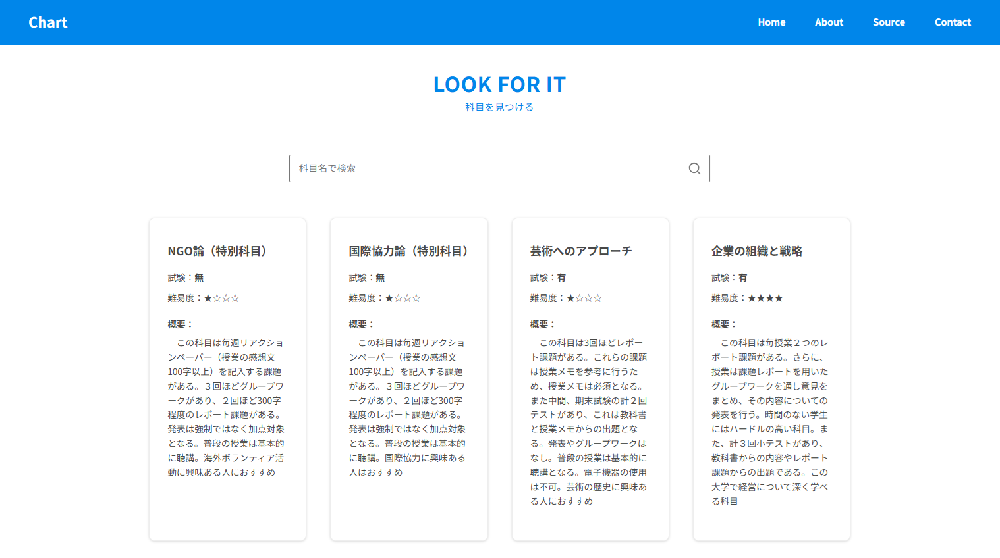
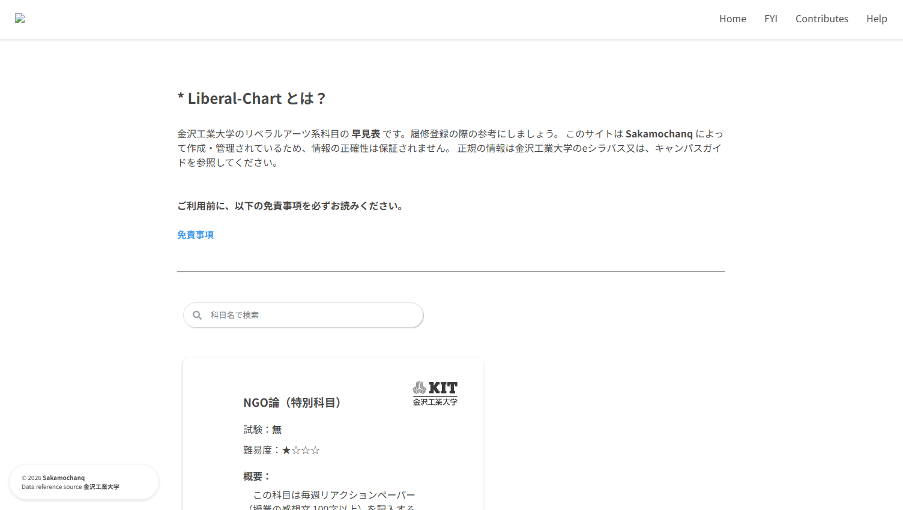

<div align="center">
    <a href="#">
        
    </a>
    <h3>Liberal-Chart</h3>
    <h4>- Sakamochanq -</h4>
</div>

<br>
<br>

## Summary

<br>

金沢工業大学のリベラルアーツ系科目の早見表です。json形式で管理しているため、編集、追記、削除などの操作を簡単に行うことができます。
素人が作成したサービスであるため、UI/UX等 ユーザビリティの良悪は不明です。
また、こちらのサイトは学生が履修登録を行う際の参考にしていただくことを目的としています。
掲載されている情報は、個人の経験や調査に基づいており、公式な情報源ではありません。最新の情報や詳細については、
大学の公式サイトやeシラバスを参照してください。[**免責事項**](./SECURITY.md)を要確認の上で、ご利用ください。
私が卒業するまでに、このリポジトリの継いでくれる方が現れなければ、時期サービスは終了するでしょう。

<br>
<br>

## Screenies

<br>

* 2025年 11月 30日 

<br>

<div align="center">
    
</div>

<br>
<br>

* 2025年 01月 24日

<br>

<div align="center">
    
</div>

<br>
<br>

## Install

<br>

ローカルにインストール

> gitがインストールされていない場合は、`<> Code Download ZIP`からダウンロードしてください。

```bash
git clone https://github.com/Sakamochanq/Liberal-Chart.git
```

<br>

依存関係のインストール

```bash
npm install
#or
yarn install
``` 

<br>

ローカルサーバーの起動  
`https://localhost:3000`で起動します。

```bash
npm start
#or
yarn start
```

<br>
<br>

## Deploy

<br>

Vercelを利用してデプロイしています。

<div>
    <a href="https://vercel.com/new">
        
    </a>
</div>


<br>
<br>

## Authors

<br>

* [Sakamochanq](https://github.com/Sakamochanq) による開発・保守

    * [Github Copilot](https://github.com/features/copilot) による開発支援

    * [CSS Stock](https://pote-chil.com/css-stock/ja/) によるデザイン支援


<br>

## License

<br>

Release under the [Apache 2.0](./LICENSE) License.