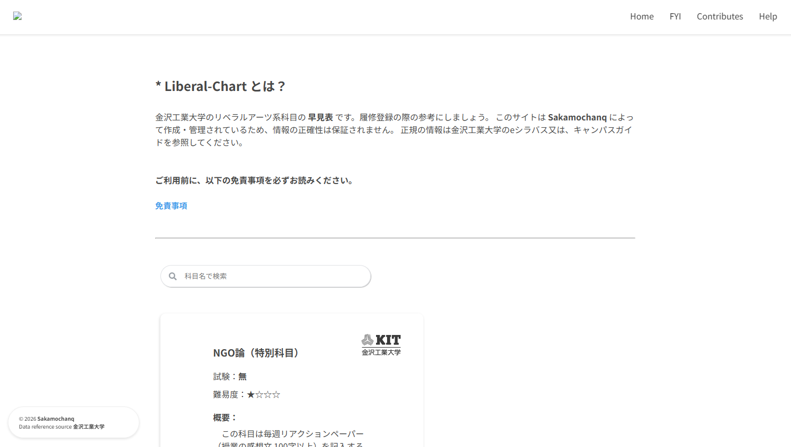
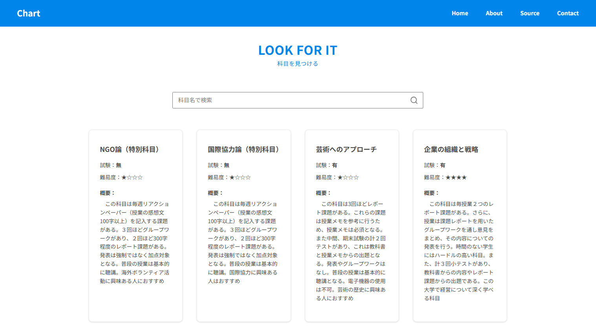

<div align="center">
    <h2>LIBERAL-CHART</h2>
    <p>金沢工業大学のリベラルアーツ系科目の早見表 💎</p>
</div>

<br>
<br>

<h3>概要</h3>

金沢工業大学のリベラルアーツ系科目の早見表です。json形式で管理しているため、編集、追記、削除などの操作を簡単に行うことができます。
素人が作成したサービスであるため、UI/UX等 ユーザビリティの良悪は不明です。
また、こちらのサイトは学生が履修登録を行う際の参考にしていただくことを目的としています。
掲載されている情報は、個人の経験や調査に基づいており、公式な情報源ではありません。最新の情報や詳細については、
大学の公式サイトやeシラバスを参照してください。[**免責事項**](./SECURITY.md)を要確認の上で、ご利用ください。

<br>
<br>

<h3>開発背景</h3>

金沢工業大学にはリベラルアーツという科目があり、豊富な選択肢がある一方で、情報が散在しているため、学生が履修登録を行う際に`どれがどんな授業なのか`不便を感じることが多いでしょう。
そこで、リベラルアーツ系科目の情報を一元管理し、学生が簡単にアクセスできるようにするためのサービスを開発しました。
科目を一覧で表示し、科目の内容や特徴を簡単に確認できるようにすることで、学生が自分に合った科目を選択しやすくなると感じます。

<br>
<br>

<div>
  <table>
    <thead>
      <tr>
        <th>2025年 01月 24日</th>
        <th>2025年 11月 30日</th>
      </tr>
    </thead>
    <tbody>
      <tr>
        <td>
            <a href="#">
                
            </a>
        </td>
        <td>
            <a href="#">
                
            </a>
        </td>
      </tr>
    </tbody>
  </table>
</div>

<br>
<br>

<h3>技術スタック</h3>

<div>
  <table>
    <thead>
      <tr>
        <th>項目</th>
        <th>技術</th>
      </tr>
    </thead>
    <tbody>
      <tr>
        <td>開発言語</td>
        <td>JavaScript</td>
      </tr>
      <tr>
        <td>Frontend</td>
        <td>React</td>
      </tr>
      <tr>
        <td>Backend</td>
        <td>Node.js</td>
      </tr>
      <tr>
        <td>Deploy</td>
        <td>
            <a href="https://vercel.com/new">
                
            </a>
        </td>
      </tr>
    </tbody>
  </table>
</div>

<br>
<br>

<h3>環境構築</h3>

1. リポジトリのクローン

    gitがインストールされていない場合は、`<> Code Download ZIP`からダウンロードしてください。

    ```bash
    git clone https://github.com/Sakamochanq/Liberal-Chart.git
    cd Liberal-Chart
    ```

<br>

2. 依存関係のインストール

    ```bash
    npm install
    ```

<br>

3. 開発サーバーの起動

    ```bash
    npm start
    ```

<br>

4. ブラウザで `http://localhost:3000` にアクセス

    開発サーバーが起動したら、ブラウザで `http://localhost:3000` にアクセスして、アプリケーションを確認してください。


<br>

5. プロジェクトのビルド

    ```bash
    npm run build
    ```

    ビルドが成功すると、`build` フォルダが生成されます。このフォルダには、デプロイ可能な静的ファイルが含まれています。


<br>
<br>

<h3>現状の課題と改善点</h3>

現状、科目の情報が少なく、ユーザーが求める情報を十分に提供できていない可能性があります。
また、UI/UXの面でも改善の余地があると考えています。ユーザビリティを向上させるために、以下の点を改善する予定です。

- 科目の情報の充実化
- UI/UXの改善


<br>
<br>

<h3>著者</h3>

Sakamochanq

<br>
<br>